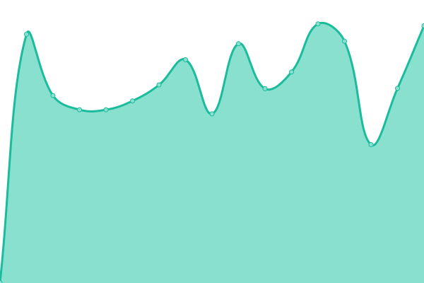

# [📈 Live Status](https://status.serverssh.net): <!--live status--> **🟩 All systems operational**

This repository contains the open-source uptime monitor and status page for [serversshnet](https://status.serverssh.net), powered by [Upptime](https://github.com/upptime/upptime).

<!--start: status pages-->
<!-- This summary is generated by Upptime (https://github.com/upptime/upptime) -->
<!-- Do not edit this manually, your changes will be overwritten -->
<!-- prettier-ignore -->
| URL | Status | History | Response Time | Uptime |
| --- | ------ | ------- | ------------- | ------ |
|  [Serverssh.net](https://serverssh.net/) | 🟩 Up | [serverssh-net.yml](https://github.com/serversshnet/server-status/commits/HEAD/history/serverssh-net.yml) | 

 224ms
     
 | 

<a href="https://status.serverssh.net/history/serverssh-net">99.73%</a>
    

|  [sg1ray.serverssh.net](http://sg1ray.serverssh.net) | 🟩 Up | [sg1ray-serverssh-net.yml](https://github.com/serversshnet/server-status/commits/HEAD/history/sg1ray-serverssh-net.yml) | 

 1205ms
     
 | 

<a href="https://status.serverssh.net/history/sg1ray-serverssh-net">98.51%</a>
    

|  [sg2ray.serverssh.net](http://sg2ray.serverssh.net) | 🟩 Up | [sg2ray-serverssh-net.yml](https://github.com/serversshnet/server-status/commits/HEAD/history/sg2ray-serverssh-net.yml) | 

 434ms
     
 | 

<a href="https://status.serverssh.net/history/sg2ray-serverssh-net">86.09%</a>
    

|  [sg3ray.serverssh.net](http://sg3ray.serverssh.net/) | 🟩 Up | [sg3ray-serverssh-net.yml](https://github.com/serversshnet/server-status/commits/HEAD/history/sg3ray-serverssh-net.yml) | 

 475ms
     
 | 

<a href="https://status.serverssh.net/history/sg3ray-serverssh-net">99.79%</a>
    

|  [ukray.serverssh.net](http://ukray.serverssh.net/) | 🟩 Up | [ukray-serverssh-net.yml](https://github.com/serversshnet/server-status/commits/HEAD/history/ukray-serverssh-net.yml) | 

 253ms
     
 | 

<a href="https://status.serverssh.net/history/ukray-serverssh-net">100.00%</a>
    

|  [ca1ray.serverssh.net](http://ca1ray.serverssh.net/) | 🟩 Up | [ca1ray-serverssh-net.yml](https://github.com/serversshnet/server-status/commits/HEAD/history/ca1ray-serverssh-net.yml) | 

 128ms
     
 | 

<a href="https://status.serverssh.net/history/ca1ray-serverssh-net">100.00%</a>
    

|  [geray.serverssh.net](http://geray.serverssh.net/) | 🟩 Up | [geray-serverssh-net.yml](https://github.com/serversshnet/server-status/commits/HEAD/history/geray-serverssh-net.yml) | 

 292ms
     
 | 

<a href="https://status.serverssh.net/history/geray-serverssh-net">100.00%</a>
    

|  [sgm1ray.serverssh.net](http://sgm1ray.serverssh.net/) | 🟩 Up | [sgm1ray-serverssh-net.yml](https://github.com/serversshnet/server-status/commits/HEAD/history/sgm1ray-serverssh-net.yml) | 

 844ms
     
 | 

<a href="https://status.serverssh.net/history/sgm1ray-serverssh-net">99.36%</a>
    

|  [sg1grpc.serverssh.us](http://sg1grpc.serverssh.us/) | 🟩 Up | [sg1grpc-serverssh-us.yml](https://github.com/serversshnet/server-status/commits/HEAD/history/sg1grpc-serverssh-us.yml) | 

 413ms
     
 | 

<a href="https://status.serverssh.net/history/sg1grpc-serverssh-us">86.09%</a>
    

|  [sg2grpc.serverssh.us](http://sg2grpc.serverssh.us/) | 🟩 Up | [sg2grpc-serverssh-us.yml](https://github.com/serversshnet/server-status/commits/HEAD/history/sg2grpc-serverssh-us.yml) | 

 907ms
     
 | 

<a href="https://status.serverssh.net/history/sg2grpc-serverssh-us">98.71%</a>
    

|  [ca1grpc.serverssh.us](http://ca1grpc.serverssh.us/) | 🟩 Up | [ca1grpc-serverssh-us.yml](https://github.com/serversshnet/server-status/commits/HEAD/history/ca1grpc-serverssh-us.yml) | 

 129ms
     
 | 

<a href="https://status.serverssh.net/history/ca1grpc-serverssh-us">100.00%</a>
    

|  [degrpc.serverssh.us](http://degrpc.serverssh.us/) | 🟩 Up | [degrpc-serverssh-us.yml](https://github.com/serversshnet/server-status/commits/HEAD/history/degrpc-serverssh-us.yml) | 

 283ms
     
 | 

<a href="https://status.serverssh.net/history/degrpc-serverssh-us">100.00%</a>
    

|  [ukgrpc.serverssh.us](http://ukgrpc.serverssh.us/) | 🟩 Up | [ukgrpc-serverssh-us.yml](https://github.com/serversshnet/server-status/commits/HEAD/history/ukgrpc-serverssh-us.yml) | 

 242ms
     
 | 

<a href="https://status.serverssh.net/history/ukgrpc-serverssh-us">100.00%</a>
    

|  [sgmgrpc.serverssh.us](http://sgmgrpc.serverssh.us/) | 🟩 Up | [sgmgrpc-serverssh-us.yml](https://github.com/serversshnet/server-status/commits/HEAD/history/sgmgrpc-serverssh-us.yml) | 

 1064ms
     
 | 

<a href="https://status.serverssh.net/history/sgmgrpc-serverssh-us">99.25%</a>
    

|  [sg1.serverssh.net](http://sg1.serverssh.net:10000/) | 🟩 Up | [sg1-serverssh-net.yml](https://github.com/serversshnet/server-status/commits/HEAD/history/sg1-serverssh-net.yml) | 

 566ms
     
 | 

<a href="https://status.serverssh.net/history/sg1-serverssh-net">92.71%</a>
    

|  [sg2.serverssh.net](http://sg2.serverssh.net:10000/) | 🟩 Up | [sg2-serverssh-net.yml](https://github.com/serversshnet/server-status/commits/HEAD/history/sg2-serverssh-net.yml) | 

 583ms
     
 | 

<a href="https://status.serverssh.net/history/sg2-serverssh-net">85.84%</a>
    

|  [sg3.serverssh.net](http://sg3.serverssh.net:10000/) | 🟩 Up | [sg3-serverssh-net.yml](https://github.com/serversshnet/server-status/commits/HEAD/history/sg3-serverssh-net.yml) | 

 568ms
     
 | 

<a href="https://status.serverssh.net/history/sg3-serverssh-net">100.00%</a>
    

|  [ca.serverssh.net](http://ca.serverssh.net:10000/) | 🟩 Up | [ca-serverssh-net.yml](https://github.com/serversshnet/server-status/commits/HEAD/history/ca-serverssh-net.yml) | 

 283ms
     
 | 

<a href="https://status.serverssh.net/history/ca-serverssh-net">100.00%</a>
    

|  [ge.serverssh.net](http://ge.serverssh.net:10000/) | 🟩 Up | [ge-serverssh-net.yml](https://github.com/serversshnet/server-status/commits/HEAD/history/ge-serverssh-net.yml) | 

 2996ms
     
 | 

<a href="https://status.serverssh.net/history/ge-serverssh-net">99.63%</a>
    

|  [fr.serverssh.net](http://fr.serverssh.net:10000/) | 🟩 Up | [fr-serverssh-net.yml](https://github.com/serversshnet/server-status/commits/HEAD/history/fr-serverssh-net.yml) | 

 425ms
     
 | 

<a href="https://status.serverssh.net/history/fr-serverssh-net">100.00%</a>
    

|  [po.serverssh.net](http://po.serverssh.net:10000/) | 🟩 Up | [po-serverssh-net.yml](https://github.com/serversshnet/server-status/commits/HEAD/history/po-serverssh-net.yml) | 

 442ms
     
 | 

<a href="https://status.serverssh.net/history/po-serverssh-net">100.00%</a>
    

|  [SG1 SLOW DNS](http://sg1.serverssh.net:10000/) | 🟩 Up | [sg-1-slow-dns.yml](https://github.com/serversshnet/server-status/commits/HEAD/history/sg-1-slow-dns.yml) | 

 538ms
     
 | 

<a href="https://status.serverssh.net/history/sg-1-slow-dns">92.71%</a>
    

|  [SG2 SLOW DNS](http://sg2.serverssh.net:10000/) | 🟩 Up | [sg-2-slow-dns.yml](https://github.com/serversshnet/server-status/commits/HEAD/history/sg-2-slow-dns.yml) | 

 575ms
     
 | 

<a href="https://status.serverssh.net/history/sg-2-slow-dns">85.68%</a>
    

|  [CA SLOW DNS](http://ca.serverssh.net:10000/) | 🟩 Up | [ca-slow-dns.yml](https://github.com/serversshnet/server-status/commits/HEAD/history/ca-slow-dns.yml) | 

 257ms
     
 | 

<a href="https://status.serverssh.net/history/ca-slow-dns">100.00%</a>
    

|  [FR SLOW DNS](http://fr.serverssh.net:10000/) | 🟩 Up | [fr-slow-dns.yml](https://github.com/serversshnet/server-status/commits/HEAD/history/fr-slow-dns.yml) | 

 405ms
     
 | 

<a href="https://status.serverssh.net/history/fr-slow-dns">100.00%</a>
    

|  [GE SLOW DNS](http://ge.serverssh.net:10000/) | 🟩 Up | [ge-slow-dns.yml](https://github.com/serversshnet/server-status/commits/HEAD/history/ge-slow-dns.yml) | 

 1585ms
     
 | 

<a href="https://status.serverssh.net/history/ge-slow-dns">99.82%</a>
    

|  [UK SLOW DNS](http://ukray.serverssh.net/) | 🟩 Up | [uk-slow-dns.yml](https://github.com/serversshnet/server-status/commits/HEAD/history/uk-slow-dns.yml) | 

 233ms
     
 | 

<a href="https://status.serverssh.net/history/uk-slow-dns">100.00%</a>
    

|  [SGX SLOW DNS](http://sg1ray.serverssh.net/) | 🟩 Up | [sgx-slow-dns.yml](https://github.com/serversshnet/server-status/commits/HEAD/history/sgx-slow-dns.yml) | 

 1481ms
     
 | 

<a href="https://status.serverssh.net/history/sgx-slow-dns">98.83%</a>
    

|  [SG2X SLOW DNS](http://sg3ray.serverssh.net/) | 🟩 Up | [sg-2-x-slow-dns.yml](https://github.com/serversshnet/server-status/commits/HEAD/history/sg-2-x-slow-dns.yml) | 

 409ms
     
 | 

<a href="https://status.serverssh.net/history/sg-2-x-slow-dns">99.40%</a>
    

|  [sgx1.serverssh.net](http://sgx1.serverssh.net:10000/) | 🟩 Up | [sgx1-serverssh-net.yml](https://github.com/serversshnet/server-status/commits/HEAD/history/sgx1-serverssh-net.yml) | 

 585ms
     
 | 

<a href="https://status.serverssh.net/history/sgx1-serverssh-net">92.90%</a>
    

|  [sgx2.serverssh.net](http://sgx2.serverssh.net:10000/) | 🟩 Up | [sgx2-serverssh-net.yml](https://github.com/serversshnet/server-status/commits/HEAD/history/sgx2-serverssh-net.yml) | 

 580ms
     
 | 

<a href="https://status.serverssh.net/history/sgx2-serverssh-net">85.85%</a>
    

|  [cax.serverssh.net](http://cax.serverssh.net:10000/) | 🟩 Up | [cax-serverssh-net.yml](https://github.com/serversshnet/server-status/commits/HEAD/history/cax-serverssh-net.yml) | 

 258ms
     
 | 

<a href="https://status.serverssh.net/history/cax-serverssh-net">100.00%</a>
    

|  [plx.serverssh.net](http://plx.serverssh.net:10000/) | 🟩 Up | [plx-serverssh-net.yml](https://github.com/serversshnet/server-status/commits/HEAD/history/plx-serverssh-net.yml) | 

 432ms
     
 | 

<a href="https://status.serverssh.net/history/plx-serverssh-net">100.00%</a>
    

|  [dex.serverssh.net](http://dex.serverssh.net:10000/) | 🟩 Up | [dex-serverssh-net.yml](https://github.com/serversshnet/server-status/commits/HEAD/history/dex-serverssh-net.yml) | 

 1550ms
     
 | 

<a href="https://status.serverssh.net/history/dex-serverssh-net">99.73%</a>
    

|  [sgm1.serverssh.net](http://sgm1.serverssh.net:10000/) | 🟩 Up | [sgm1-serverssh-net.yml](https://github.com/serversshnet/server-status/commits/HEAD/history/sgm1-serverssh-net.yml) | 

 615ms
     
 | 

<a href="https://status.serverssh.net/history/sgm1-serverssh-net">99.83%</a>
    

|  [sgm2.serverssh.net](http://sgm2.serverssh.net:10000/) | 🟩 Up | [sgm2-serverssh-net.yml](https://github.com/serversshnet/server-status/commits/HEAD/history/sgm2-serverssh-net.yml) | 

 571ms
     
 | 

<a href="https://status.serverssh.net/history/sgm2-serverssh-net">100.00%</a>
    

|  [sgm3.serverssh.net](http://sgm3.serverssh.net:10000/) | 🟩 Up | [sgm3-serverssh-net.yml](https://github.com/serversshnet/server-status/commits/HEAD/history/sgm3-serverssh-net.yml) | 

 571ms
     
 | 

<a href="https://status.serverssh.net/history/sgm3-serverssh-net">100.00%</a>
    

|  [sgm4.serverssh.net](http://sgm4.serverssh.net:10000/) | 🟩 Up | [sgm4-serverssh-net.yml](https://github.com/serversshnet/server-status/commits/HEAD/history/sgm4-serverssh-net.yml) | 

 552ms
     
 | 

<a href="https://status.serverssh.net/history/sgm4-serverssh-net">100.00%</a>
    

|  [sgm5.serverssh.net](http://sgm5.serverssh.net:10000/) | 🟩 Up | [sgm5-serverssh-net.yml](https://github.com/serversshnet/server-status/commits/HEAD/history/sgm5-serverssh-net.yml) | 

 564ms
     
 | 

<a href="https://status.serverssh.net/history/sgm5-serverssh-net">100.00%</a>
    

|  [sgm6.serverssh.net](http://sgm6.serverssh.net:10000/) | 🟩 Up | [sgm6-serverssh-net.yml](https://github.com/serversshnet/server-status/commits/HEAD/history/sgm6-serverssh-net.yml) | 

 559ms
     
 | 

<a href="https://status.serverssh.net/history/sgm6-serverssh-net">100.00%</a>
    

|  [sg1vpn.serverssh.net](http://sg1vpn.serverssh.net:10000/) | 🟩 Up | [sg1vpn-serverssh-net.yml](https://github.com/serversshnet/server-status/commits/HEAD/history/sg1vpn-serverssh-net.yml) | 

 564ms
     
 | 

<a href="https://status.serverssh.net/history/sg1vpn-serverssh-net">100.00%</a>
    

|  [sg2vpn.serverssh.net](http://sg2vpn.serverssh.net:10000/) | 🟩 Up | [sg2vpn-serverssh-net.yml](https://github.com/serversshnet/server-status/commits/HEAD/history/sg2vpn-serverssh-net.yml) | 

 580ms
     
 | 

<a href="https://status.serverssh.net/history/sg2vpn-serverssh-net">100.00%</a>
    

|  [sg1socks.serverssh.net](http://sg1socks.serverssh.net:10000/) | 🟩 Up | [sg1socks-serverssh-net.yml](https://github.com/serversshnet/server-status/commits/HEAD/history/sg1socks-serverssh-net.yml) | 

 559ms
     
 | 

<a href="https://status.serverssh.net/history/sg1socks-serverssh-net">100.00%</a>
    

|  [sg2socks.serverssh.net](http://sg2socks.serverssh.net:10000/) | 🟩 Up | [sg2socks-serverssh-net.yml](https://github.com/serversshnet/server-status/commits/HEAD/history/sg2socks-serverssh-net.yml) | 

 552ms
     
 | 

<a href="https://status.serverssh.net/history/sg2socks-serverssh-net">100.00%</a>
    

<!--end: status pages-->

[**Visit our status website →**](https://status.serverssh.net)

## 📄 License

- Powered by: [Upptime](https://github.com/upptime/upptime)
- Code: [MIT](./LICENSE) © [serversshnet](https://status.serverssh.net)
- Data in the `./history` directory: [Open Database License](https://opendatacommons.org/licenses/odbl/1-0/)
