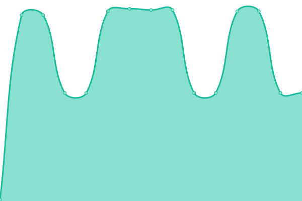

# [📈 Live Status](https://status.serverssh.net): <!--live status--> **🟩 All systems operational**

This repository contains the open-source uptime monitor and status page for [serversshnet](https://status.serverssh.net), powered by [Upptime](https://github.com/upptime/upptime).

<!--start: status pages-->
<!-- This summary is generated by Upptime (https://github.com/upptime/upptime) -->
<!-- Do not edit this manually, your changes will be overwritten -->
<!-- prettier-ignore -->
| URL | Status | History | Response Time | Uptime |
| --- | ------ | ------- | ------------- | ------ |
|  [Serverssh.net - Website](serverssh.net) | 🟩 Up | [serverssh-net-website.yml](https://github.com/serversshnet/server-status/commits/HEAD/history/serverssh-net-website.yml) | 

 15ms
     
 | 

<a href="https://status.serverssh.net/history/serverssh-net-website">100.00%</a>
    

|  [sg1.serverssh.net](sg1.serverssh.net) | 🟩 Up | [sg1-serverssh-net.yml](https://github.com/serversshnet/server-status/commits/HEAD/history/sg1-serverssh-net.yml) | 

 291ms
     
 | 

<a href="https://status.serverssh.net/history/sg1-serverssh-net">100.00%</a>
    

|  [sg2.serverssh.net](sg2.serverssh.net) | 🟩 Up | [sg2-serverssh-net.yml](https://github.com/serversshnet/server-status/commits/HEAD/history/sg2-serverssh-net.yml) | 

 263ms
     
 | 

<a href="https://status.serverssh.net/history/sg2-serverssh-net">92.93%</a>
    

|  [sg3.serverssh.net](sg3.serverssh.net) | 🟩 Up | [sg3-serverssh-net.yml](https://github.com/serversshnet/server-status/commits/HEAD/history/sg3-serverssh-net.yml) | 

 273ms
     
 | 

<a href="https://status.serverssh.net/history/sg3-serverssh-net">100.00%</a>
    

|  [sgx1.serverssh.net](sgx1.serverssh.net) | 🟩 Up | [sgx1-serverssh-net.yml](https://github.com/serversshnet/server-status/commits/HEAD/history/sgx1-serverssh-net.yml) | 

 266ms
     
 | 

<a href="https://status.serverssh.net/history/sgx1-serverssh-net">100.00%</a>
    

|  [sgx2.serverssh.net](sgx2.serverssh.net) | 🟩 Up | [sgx2-serverssh-net.yml](https://github.com/serversshnet/server-status/commits/HEAD/history/sgx2-serverssh-net.yml) | 

 284ms
     
 | 

<a href="https://status.serverssh.net/history/sgx2-serverssh-net">92.94%</a>
    

|  [sgm1.serverssh.net](sgm1.serverssh.net) | 🟩 Up | [sgm1-serverssh-net.yml](https://github.com/serversshnet/server-status/commits/HEAD/history/sgm1-serverssh-net.yml) | 

 239ms
     
 | 

<a href="https://status.serverssh.net/history/sgm1-serverssh-net">99.66%</a>
    

|  [sgm2.serverssh.net](sgm2.serverssh.net) | 🟩 Up | [sgm2-serverssh-net.yml](https://github.com/serversshnet/server-status/commits/HEAD/history/sgm2-serverssh-net.yml) | 

 268ms
     
 | 

<a href="https://status.serverssh.net/history/sgm2-serverssh-net">100.00%</a>
    

|  [sgm3.serverssh.net](sgm3.serverssh.net) | 🟩 Up | [sgm3-serverssh-net.yml](https://github.com/serversshnet/server-status/commits/HEAD/history/sgm3-serverssh-net.yml) | 

 260ms
     
 | 

<a href="https://status.serverssh.net/history/sgm3-serverssh-net">100.00%</a>
    

|  [sg1socks.serverssh.net](sg1socks.serverssh.net) | 🟩 Up | [sg1socks-serverssh-net.yml](https://github.com/serversshnet/server-status/commits/HEAD/history/sg1socks-serverssh-net.yml) | 

 261ms
     
 | 

<a href="https://status.serverssh.net/history/sg1socks-serverssh-net">100.00%</a>
    

|  [sgx3.serverssh.net](sgx3.serverssh.net) | 🟩 Up | [sgx3-serverssh-net.yml](https://github.com/serversshnet/server-status/commits/HEAD/history/sgx3-serverssh-net.yml) | 

 250ms
     
 | 

<a href="https://status.serverssh.net/history/sgx3-serverssh-net">100.00%</a>
    

|  [sg2socks.serverssh.net](sg2socks.serverssh.net) | 🟩 Up | [sg2socks-serverssh-net.yml](https://github.com/serversshnet/server-status/commits/HEAD/history/sg2socks-serverssh-net.yml) | 

 254ms
     
 | 

<a href="https://status.serverssh.net/history/sg2socks-serverssh-net">100.00%</a>
    

|  [sg1ray.serverip.my.id](sg1ray.serverip.my.id) | 🟩 Up | [sg1ray-serverip-my-id.yml](https://github.com/serversshnet/server-status/commits/HEAD/history/sg1ray-serverip-my-id.yml) | 

 319ms
     
 | 

<a href="https://status.serverssh.net/history/sg1ray-serverip-my-id">100.00%</a>
    

|  [sg2ray.serverip.my.id](sg2ray.serverip.my.id) | 🟩 Up | [sg2ray-serverip-my-id.yml](https://github.com/serversshnet/server-status/commits/HEAD/history/sg2ray-serverip-my-id.yml) | 

 308ms
     
 | 

<a href="https://status.serverssh.net/history/sg2ray-serverip-my-id">100.00%</a>
    

|  [sg3ray.serverip.my.id](sg3ray.serverip.my.id) | 🟩 Up | [sg3ray-serverip-my-id.yml](https://github.com/serversshnet/server-status/commits/HEAD/history/sg3ray-serverip-my-id.yml) | 

 359ms
     
 | 

<a href="https://status.serverssh.net/history/sg3ray-serverip-my-id">100.00%</a>
    

|  [ukray.serverip.my.id](ukray.serverip.my.id) | 🟩 Up | [ukray-serverip-my-id.yml](https://github.com/serversshnet/server-status/commits/HEAD/history/ukray-serverip-my-id.yml) | 

 118ms
     
 | 

<a href="https://status.serverssh.net/history/ukray-serverip-my-id">96.72%</a>
    

|  [caray.serverip.my.id](caray.serverip.my.id) | 🟩 Up | [caray-serverip-my-id.yml](https://github.com/serversshnet/server-status/commits/HEAD/history/caray-serverip-my-id.yml) | 

 48ms
     
 | 

<a href="https://status.serverssh.net/history/caray-serverip-my-id">86.22%</a>
    

|  [sg1vpn.serverssh.net](sg1vpn.serverssh.net) | 🟩 Up | [sg1vpn-serverssh-net.yml](https://github.com/serversshnet/server-status/commits/HEAD/history/sg1vpn-serverssh-net.yml) | 

 252ms
     
 | 

<a href="https://status.serverssh.net/history/sg1vpn-serverssh-net">100.00%</a>
    

|  [sg2vpn.serverssh.net](sg2vpn.serverssh.net) | 🟩 Up | [sg2vpn-serverssh-net.yml](https://github.com/serversshnet/server-status/commits/HEAD/history/sg2vpn-serverssh-net.yml) | 

 242ms
     
 | 

<a href="https://status.serverssh.net/history/sg2vpn-serverssh-net">100.00%</a>
    

|  [ca.serverssh.net](ca.serverssh.net) | 🟩 Up | [ca-serverssh-net.yml](https://github.com/serversshnet/server-status/commits/HEAD/history/ca-serverssh-net.yml) | 

 43ms
     
 | 

<a href="https://status.serverssh.net/history/ca-serverssh-net">100.00%</a>
    

|  [sg1ray.serverssh.net](sg1ray.serverssh.net) | 🟩 Up | [sg1ray-serverssh-net.yml](https://github.com/serversshnet/server-status/commits/HEAD/history/sg1ray-serverssh-net.yml) | 

 284ms
     
 | 

<a href="https://status.serverssh.net/history/sg1ray-serverssh-net">100.00%</a>
    

|  [geray.serverip.my.id](geray.serverip.my.id) | 🟩 Up | [geray-serverip-my-id.yml](https://github.com/serversshnet/server-status/commits/HEAD/history/geray-serverip-my-id.yml) | 

 119ms
     
 | 

<a href="https://status.serverssh.net/history/geray-serverip-my-id">69.24%</a>
    

|  [ge.serverssh.net](ge.serverssh.net) | 🟩 Up | [ge-serverssh-net.yml](https://github.com/serversshnet/server-status/commits/HEAD/history/ge-serverssh-net.yml) | 

 118ms
     
 | 

<a href="https://status.serverssh.net/history/ge-serverssh-net">100.00%</a>
    

|  [fr.serverssh.net](fr.serverssh.net) | 🟩 Up | [fr-serverssh-net.yml](https://github.com/serversshnet/server-status/commits/HEAD/history/fr-serverssh-net.yml) | 

 111ms
     
 | 

<a href="https://status.serverssh.net/history/fr-serverssh-net">100.00%</a>
    

|  [po.serverssh.net](po.serverssh.net) | 🟩 Up | [po-serverssh-net.yml](https://github.com/serversshnet/server-status/commits/HEAD/history/po-serverssh-net.yml) | 

 134ms
     
 | 

<a href="https://status.serverssh.net/history/po-serverssh-net">100.00%</a>
    

|  [cax.serverssh.net](cax.serverssh.net) | 🟩 Up | [cax-serverssh-net.yml](https://github.com/serversshnet/server-status/commits/HEAD/history/cax-serverssh-net.yml) | 

 44ms
     
 | 

<a href="https://status.serverssh.net/history/cax-serverssh-net">100.00%</a>
    

|  [frx.serverssh.net](frx.serverssh.net) | 🟩 Up | [frx-serverssh-net.yml](https://github.com/serversshnet/server-status/commits/HEAD/history/frx-serverssh-net.yml) | 

 112ms
     
 | 

<a href="https://status.serverssh.net/history/frx-serverssh-net">100.00%</a>
    

|  [plx.serverssh.net](plx.serverssh.net) | 🟩 Up | [plx-serverssh-net.yml](https://github.com/serversshnet/server-status/commits/HEAD/history/plx-serverssh-net.yml) | 

 133ms
     
 | 

<a href="https://status.serverssh.net/history/plx-serverssh-net">100.00%</a>
    

|  [dex.serverssh.net](dex.serverssh.net) | 🟩 Up | [dex-serverssh-net.yml](https://github.com/serversshnet/server-status/commits/HEAD/history/dex-serverssh-net.yml) | 

 118ms
     
 | 

<a href="https://status.serverssh.net/history/dex-serverssh-net">100.00%</a>
    

|  [sgm4.serverssh.net](sgm4.serverssh.net) | 🟩 Up | [sgm4-serverssh-net.yml](https://github.com/serversshnet/server-status/commits/HEAD/history/sgm4-serverssh-net.yml) | 

 261ms
     
 | 

<a href="https://status.serverssh.net/history/sgm4-serverssh-net">100.00%</a>
    

|  [sgm5.serverssh.net](sgm5.serverssh.net) | 🟩 Up | [sgm5-serverssh-net.yml](https://github.com/serversshnet/server-status/commits/HEAD/history/sgm5-serverssh-net.yml) | 

 244ms
     
 | 

<a href="https://status.serverssh.net/history/sgm5-serverssh-net">100.00%</a>
    

|  [sgm6.serverssh.net](sgm6.serverssh.net) | 🟩 Up | [sgm6-serverssh-net.yml](https://github.com/serversshnet/server-status/commits/HEAD/history/sgm6-serverssh-net.yml) | 

 253ms
     
 | 

<a href="https://status.serverssh.net/history/sgm6-serverssh-net">100.00%</a>
    

|  [sgm1ray.serverip.my.id](sgm1ray.serverip.my.id) | 🟩 Up | [sgm1ray-serverip-my-id.yml](https://github.com/serversshnet/server-status/commits/HEAD/history/sgm1ray-serverip-my-id.yml) | 

 362ms
     
 | 

<a href="https://status.serverssh.net/history/sgm1ray-serverip-my-id">100.00%</a>
    

|  [sg3ray.serverssh.net](sg3ray.serverssh.net) | 🟩 Up | [sg3ray-serverssh-net.yml](https://github.com/serversshnet/server-status/commits/HEAD/history/sg3ray-serverssh-net.yml) | 

 333ms
     
 | 

<a href="https://status.serverssh.net/history/sg3ray-serverssh-net">100.00%</a>
    

|  [sg1.serverssh.net](sg1.serverssh.net) | 🟩 Up | [sg1-serverssh-net.yml](https://github.com/serversshnet/server-status/commits/HEAD/history/sg1-serverssh-net.yml) | 

 291ms
     
 | 

<a href="https://status.serverssh.net/history/sg1-serverssh-net">100.00%</a>
    

|  [sg2.serverssh.net](sg2.serverssh.net) | 🟩 Up | [sg2-serverssh-net.yml](https://github.com/serversshnet/server-status/commits/HEAD/history/sg2-serverssh-net.yml) | 

 263ms
     
 | 

<a href="https://status.serverssh.net/history/sg2-serverssh-net">92.93%</a>
    

|  [ca.serverssh.net](ca.serverssh.net) | 🟩 Up | [ca-serverssh-net.yml](https://github.com/serversshnet/server-status/commits/HEAD/history/ca-serverssh-net.yml) | 

 43ms
     
 | 

<a href="https://status.serverssh.net/history/ca-serverssh-net">100.00%</a>
    

|  [fr.serverssh.net](fr.serverssh.net) | 🟩 Up | [fr-serverssh-net.yml](https://github.com/serversshnet/server-status/commits/HEAD/history/fr-serverssh-net.yml) | 

 111ms
     
 | 

<a href="https://status.serverssh.net/history/fr-serverssh-net">100.00%</a>
    

|  [ge.serverssh.net](ge.serverssh.net) | 🟩 Up | [ge-serverssh-net.yml](https://github.com/serversshnet/server-status/commits/HEAD/history/ge-serverssh-net.yml) | 

 118ms
     
 | 

<a href="https://status.serverssh.net/history/ge-serverssh-net">100.00%</a>
    

|  [ukray.serverssh.net](ukray.serverssh.net) | 🟩 Up | [ukray-serverssh-net.yml](https://github.com/serversshnet/server-status/commits/HEAD/history/ukray-serverssh-net.yml) | 

 110ms
     
 | 

<a href="https://status.serverssh.net/history/ukray-serverssh-net">96.74%</a>
    

|  [sg1grpc.serverip.my.id](sg1grpc.serverip.my.id) | 🟩 Up | [sg1grpc-serverip-my-id.yml](https://github.com/serversshnet/server-status/commits/HEAD/history/sg1grpc-serverip-my-id.yml) | 

 279ms
     
 | 

<a href="https://status.serverssh.net/history/sg1grpc-serverip-my-id">100.00%</a>
    

|  [sg2grpc.serverip.my.id](sg2grpc.serverip.my.id) | 🟩 Up | [sg2grpc-serverip-my-id.yml](https://github.com/serversshnet/server-status/commits/HEAD/history/sg2grpc-serverip-my-id.yml) | 

 349ms
     
 | 

<a href="https://status.serverssh.net/history/sg2grpc-serverip-my-id">100.00%</a>
    

|  [ca1grpc.serverip.my.id](ca1grpc.serverip.my.id) | 🟩 Up | [ca1grpc-serverip-my-id.yml](https://github.com/serversshnet/server-status/commits/HEAD/history/ca1grpc-serverip-my-id.yml) | 

 44ms
     
 | 

<a href="https://status.serverssh.net/history/ca1grpc-serverip-my-id">86.22%</a>
    

|  [degrpc.serverip.my.id](degrpc.serverip.my.id) | 🟩 Up | [degrpc-serverip-my-id.yml](https://github.com/serversshnet/server-status/commits/HEAD/history/degrpc-serverip-my-id.yml) | 

 122ms
     
 | 

<a href="https://status.serverssh.net/history/degrpc-serverip-my-id">69.18%</a>
    

|  [ukgrpc.serverip.my.id](ukgrpc.serverip.my.id) | 🟩 Up | [ukgrpc-serverip-my-id.yml](https://github.com/serversshnet/server-status/commits/HEAD/history/ukgrpc-serverip-my-id.yml) | 

 115ms
     
 | 

<a href="https://status.serverssh.net/history/ukgrpc-serverip-my-id">96.75%</a>
    

|  [sgmgrpc.serverip.my.id](sgmgrpc.serverip.my.id) | 🟩 Up | [sgmgrpc-serverip-my-id.yml](https://github.com/serversshnet/server-status/commits/HEAD/history/sgmgrpc-serverip-my-id.yml) | 

 378ms
     
 | 

<a href="https://status.serverssh.net/history/sgmgrpc-serverip-my-id">100.00%</a>
    

|  [sg1ray.serverip.my.id](sg1ray.serverip.my.id) | 🟩 Up | [sg1ray-serverip-my-id.yml](https://github.com/serversshnet/server-status/commits/HEAD/history/sg1ray-serverip-my-id.yml) | 

 319ms
     
 | 

<a href="https://status.serverssh.net/history/sg1ray-serverip-my-id">100.00%</a>
    

|  [sg2ray.serverip.my.id](sg2ray.serverip.my.id) | 🟩 Up | [sg2ray-serverip-my-id.yml](https://github.com/serversshnet/server-status/commits/HEAD/history/sg2ray-serverip-my-id.yml) | 

 308ms
     
 | 

<a href="https://status.serverssh.net/history/sg2ray-serverip-my-id">100.00%</a>
    

|  [sg3ray.serverip.my.id](sg3ray.serverip.my.id) | 🟩 Up | [sg3ray-serverip-my-id.yml](https://github.com/serversshnet/server-status/commits/HEAD/history/sg3ray-serverip-my-id.yml) | 

 359ms
     
 | 

<a href="https://status.serverssh.net/history/sg3ray-serverip-my-id">100.00%</a>
    

|  [ukray.serverip.my.id](ukray.serverip.my.id) | 🟩 Up | [ukray-serverip-my-id.yml](https://github.com/serversshnet/server-status/commits/HEAD/history/ukray-serverip-my-id.yml) | 

 118ms
     
 | 

<a href="https://status.serverssh.net/history/ukray-serverip-my-id">96.72%</a>
    

|  [caray.serverip.my.id](caray.serverip.my.id) | 🟩 Up | [caray-serverip-my-id.yml](https://github.com/serversshnet/server-status/commits/HEAD/history/caray-serverip-my-id.yml) | 

 48ms
     
 | 

<a href="https://status.serverssh.net/history/caray-serverip-my-id">86.22%</a>
    

|  [geray.serverip.my.id](geray.serverip.my.id) | 🟩 Up | [geray-serverip-my-id.yml](https://github.com/serversshnet/server-status/commits/HEAD/history/geray-serverip-my-id.yml) | 

 119ms
     
 | 

<a href="https://status.serverssh.net/history/geray-serverip-my-id">69.24%</a>
    

|  [sgm1ray.serverip.my.id](sgm1ray.serverip.my.id) | 🟩 Up | [sgm1ray-serverip-my-id.yml](https://github.com/serversshnet/server-status/commits/HEAD/history/sgm1ray-serverip-my-id.yml) | 

 362ms
     
 | 

<a href="https://status.serverssh.net/history/sgm1ray-serverip-my-id">100.00%</a>
    

<!--end: status pages-->

[**Visit our status website →**](https://status.serverssh.net)

## 📄 License

- Powered by: [Upptime](https://github.com/upptime/upptime)
- Code: [MIT](./LICENSE) © [serversshnet](https://status.serverssh.net)
- Data in the `./history` directory: [Open Database License](https://opendatacommons.org/licenses/odbl/1-0/)
